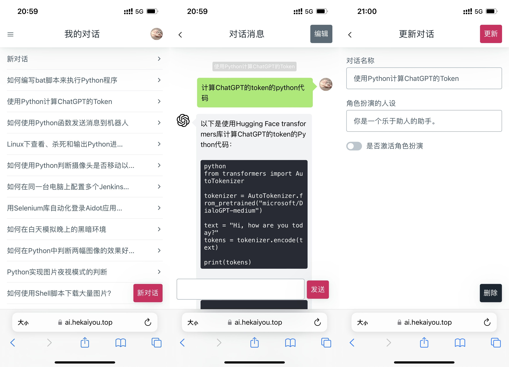

# GPT-3.5 AI小助手

使用 Python Web 作为后端框架, MongoDB 作为数据库, 以及 OpenAI 的 gpt-3.5 模型 API 作为核心服务, 让你可以通过浏览器与一个强大的自然语言生成模型进行交互。

## 📦 安装

### 操作步骤

1. 进入到 [we-fast-api](https://github.com/hekaiyou/we-fast-api) 项目的 `/apis` 目录下, 下载 [gpt_35](https://github.com/hekaiyou/gpt_35) 模块代码, 在终端执行:
   ```shell
   cd apis
   git clone https://github.com/hekaiyou/gpt_35.git
   ```
2. 再安装 [gpt_35](https://github.com/hekaiyou/gpt_35) 模块依赖, 同样在终端执行:
   ```shell
   cd gpt_35
   pip install -r requirements.txt
   ```

## ⚙️ 配置

| 应用模块 | 配置文件路径 | 描述 |
| ------- | ------- | ------- |
| gpt_35 | `apis/gpt_35/.env` | [gpt_35](https://github.com/hekaiyou/gpt_35) 模块的运行环境变量 |

### apis/gpt_35/.env

在 `apis/gpt_35/` 路径下创建 `.env` 配置文件, 参考以下内容设置具体的环境变量:

```bash
OPENAI_API_KEY=sk-xxxxxxxxxxxx
```

该目录下支持的全部环境变量参数如下:

| 环境变量 | 描述 | 类型 | 默认值 |
| ------- | ------- | ------- | ------- |
| OPENAI_API_KEY | OpenAI API key | str |  |

## 👀 预览


